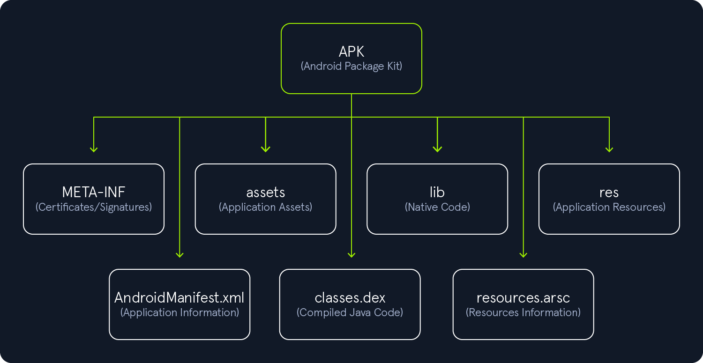

### APK-Structure
1. Apk 
- is a file that use by Android Operating system to distribute and install application
- it's archieve file that contains all components that application need to run 

2. Apk Files
- assets
- images
- UI Layout
- AndroidManifast.xml

3. Apk is a zip-based archieves
- Example to unzip it
```bash
   unzip myapp.apk
   ls -l
````
```
-rw-r--r--    1 bertolis  bertolis     4220 Jan  1  1981 AndroidManifest.xml
drwxr-xr-x   49 bertolis  bertolis     1568 May 10 13:36 META-INF
drwxr-xr-x    3 bertolis  bertolis       96 May 10 13:36 assets
-rw-r--r--    1 bertolis  bertolis  8285624 Jan  1  1981 classes.dex
drwxr-xr-x    9 bertolis  bertolis      288 May 10 13:36 kotlin
drwxr-xr-x    6 bertolis  bertolis      192 May 10 13:36 lib
drwxr-xr-x  545 bertolis  bertolis    17440 May 10 13:36 res
-rw-r--r--    1 bertolis  bertolis   922940 Jan  1  1981 resources.arsc
```
- The image below shows the unzipped structure of an APK file


- Explain Apk files
1. META-INF
> generated when the application is signed
> contains verification information

### Signature Files inside `META-INF`
| File         | Purpose | Key Contents |
|--------------|---------|--------------|
| `MANIFEST.MF` | Contains a list of names/hashes for all APK files. Used to detect if any file has been modified. | Typically SHA-256 digests in Base64 for each file and its path. |
| `CERT.SF`     | Contains digests of the corresponding lines in `MANIFEST.MF` to ensure that `MANIFEST.MF` itself has not been tampered with. | Digest values for each entry in `MANIFEST.MF`. |
| `CERT.RSA`    | Contains the public key certificate and the digital signature for `CERT.SF`. | X.509 certificate + digital signature of `CERT.SF`. |

2. assets
>  contains assets that developers bundle with the application
> can retrieved by AssetManager
- Assets can be
1.  images, videos, documents, databases, 
2. raw files. Xamarin, Cordova, and React-Native applications will use this folder to save code and DLL's as well.

3. lib
> contains native libraries with compiled code target different device architectures
> native code store in lib by **.so** extension

4. res
> contains prdefined application resources that cannot be modified by the user at runtime
> include XML files defining color state lists,configurations for os versions ,network settings,screen orientation

5. AndroidManifest.xml
> contains metadata about the application
> defines essential attributes and components that the system uses to manage the app,including
- package name,SDK Version, Build Version,Permissions,NetworkSecurityConfig,Activities,Providers,Services

6. classes.dex
> file that contains all compiled java classes in DEX format
> large application may include multiple DEX files named sequentially as
  classes2.dex,classes3.dex

7. resources.arsc
> file contains precompiled resources that are used by the app at runtime
> maps resource identifiers in the code to their actual values(such as strings,layout,style)
> include binary representation of XML resources
> can find a kotlin/ folder 