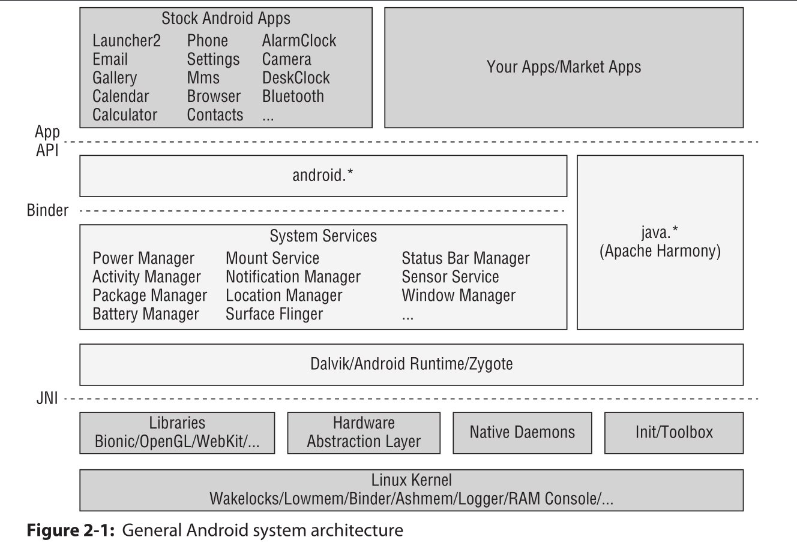

# Android Architecture
---


  
---

1. **Linux kernel**
- kernel used to manage drivers of
  - hardwares , networks , process management

- kernel of android not 100% linux kernel but there exists **androidisms** that provide
  - Low Memory Killer > kill process when memory low
  - wakelocks > this help application to run in background
  - Ashmem (anonymous shared memory) > share memory between different processes
  - Alarms > used to schedule tasks in applications
  - Paranoid Networking > restrict applications from opening network sockets without permission
  - Binder > the main system that allows application communication 

2. Hardware Abstraction Layer(HAL)
-  if a software layer that provides the android os with a standardized interface for interacting with hardware components, such as cameras, Bluetooth, sensors, and input devices
- bridge bewtween hardware and higer-level software layers
- ensure consistency in how software accesses hardware features


3. **Native user space**
   ```
     init > native daemons > native libraries 
   ```
- init > the first process that runs after kernel (PID 1)
- native daemons > provide core system services (e.g. netd, vold)
- native libraries > libraries like OpenGL, OpenSSL

4. **Android Runtime**
- Dalvik (old, until Android 4.x) > Just-in-Time
- ART (from Android 5.0 and later) > Ahead-Of-Time compilation to native code

- Difference Detween ART Vs Dalvik is
  - ART compilation by use ```Ahead-of-time```
  - Dalvik compilation by ```Just-in-Time```

- ```Ahead-of-time```
  - converts bytecode into native code at **install time** and store it
  - slower installation: as compilation happen once during install
  - faster execution: since the app runs directly in native code

- ```Just-In-Time```
  - convert bytecode into native code at runtime
  - Faster installation: because no full compilation happens at install time
  - Slower execution, since code must be compiled while running.


5. **Application framework**
- system services , android frameworks , java runtime libraries
- provides APIs such as Activity Manager, Window Manager, Content Providers


6. **Application**
- pre-installed like > home , settings, gallery
- installed by user > like video games , notion
- all are packaged as APK files

---

### Rooting
- Android separates the flash storage into two main partitions
 - /system/ > used by the operating system
 - /data/ > used for user data and application installations


### Important Directories
- Android's file structure is very similar to other linux distributions
- Examples of Important Directories
# Android Important Directories

| Directory                          | Description                                                                 |
|-----------------------------------|-----------------------------------------------------------------------------|
| `/data/data`                      | Contains all the applications that are installed by the user                |
| `/data/user/0`                    | Contains data that only the app can access                                  |
| `/data/app`                       | Contains the APKs of the applications that are installed by the user        |
| `/system/app`                     | Contains the pre-installed applications of the device                       |
| `/system/bin`                     | Contains binary files                                                       |
| `/data/local/tmp`                 | A world-writable directory                                                  |
| `/data/system`                    | Contains system configuration files                                         |
| `/etc/apns-conf.xml`              | Contains the default Access Point Name (APN) configurations                 |
| `/data/misc/wifi`                 | Contains WiFi configuration files                                           |
| `/data/misc/user/0/cacerts-added` | User certificate store (certificates added by the user)                     |
| `/etc/security/cacerts/`          | System certificate store (non-root users cannot access)                     |
| `/sdcard`                         | Symbolic link to DCIM, Downloads, Music, Pictures, and other media folders  |
