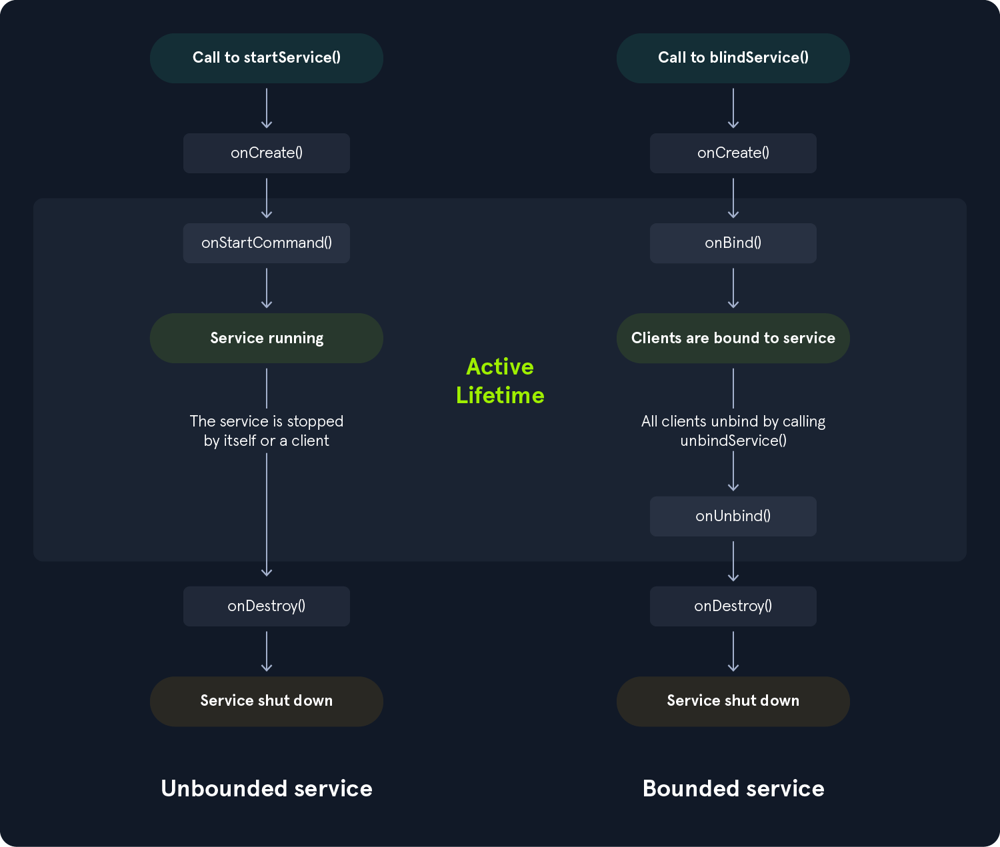

### What is Services ?
- Android application components that are used to perform long-running operations like:  
  1. downloading files  
  2. communicating with a remote server  

- The Android application has 3 Types of Services:  

1. **Foreground Service**  
   - This service needs user interaction.  
   - Example: media player apps like **Spotify** or **YouTube Music** (playing music in the background with a notification).  
   - Call **startService** when running.  

2. **Background Service**  
   - This service does not need direct user interaction.  
   - Starting from Android API 28 (Android 8.0 Oreo), background services are restricted.  
   - They can’t run by themselves until the user allows a **foreground service** to run.  
   - Example: **WhatsApp** syncing messages or **Gmail** checking for new emails in the background.  

3. **Bound Service**  
   - This acts like a small server.  
   - It waits for any activity or app to connect.  
   - After a client connects, it runs **bindService** and creates an **IBinder** object.  
   - Example: **Google Play Services** (many apps bind to it for location, authentication, etc.) or a **music app** where activities bind to the service to control playback.

---
### Android Services lifecycle
