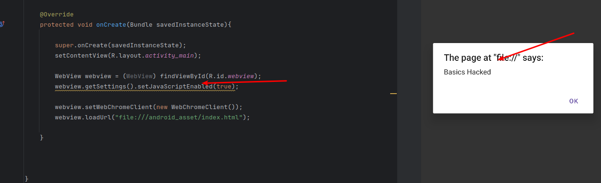
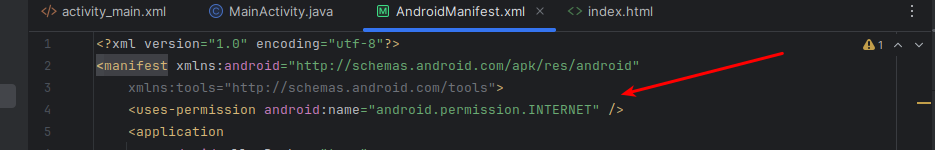
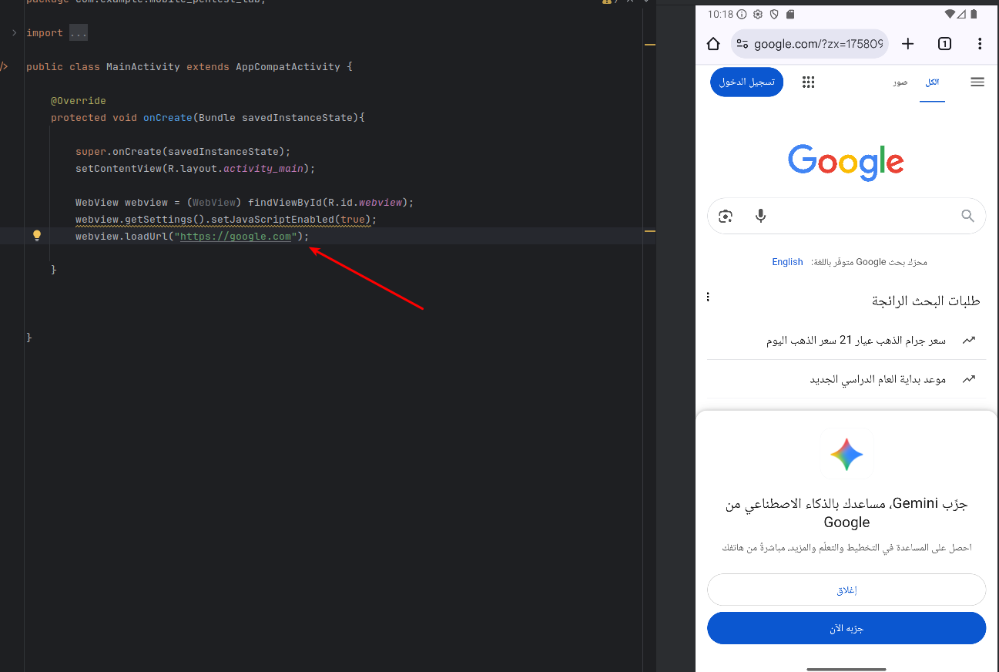

### What is Javascript&WebView
- allow developer to display and embed web content in android application
- The misconfiguration of javascript&webview can lead to vulnerablities like
  > Xss , Local file inclusion(LFI)

### Practical example 
- Create simple application by using WebView,html,css,js
1. inside **activity_main.xml** create
   ```xml
     <WebView
          android:id="@+id/webview"
          android:layout_width="match_parent"
          android:latout_height="match_parent"/>

   ```

2. create reference points to this object in **MainActivity.java**
    ```java
          package com.example.myapplication;
          import androidx.appcompat.app.AppCompatActivity;

          import android.os.Bundle;
          import android.webkit.WebView;
    

        public class MainActivity extends  AppCompatActivity{

            @override
            protected void onCreate(Bundle savedInstanceState){

            super.onCreate(savedInstanceState);
            setContentView(R.layout.activity_main);

            WebView webview = (WebView) findViewById(R.id.webview);
            webview.getSettings().setJavaScriptEnabled(true);
            webview.loadUrl("file:///android_asset/htm/index.html");

        }
    
        }

    ```

3. The html and js usually placed under the folder app/assets
   > project view > app/src/main/assets

   if the folder is missing , you can create it by

   > right-click on app > create new folder named assets

    ```html
     <html>
      <head>
       </head>
       <body>
    <h1>
    Hello Hackers
     </h1>
   <script>
       alert("Basics Hacked");
   </script>
    </body>
    </html>
 
   ```

As this The **setJavaScriptEnabled(true)** allow to execute javascript code you can before **XSS**



4. <strong>can also load from sources outside the local project by 
add this permission in **AndroidMainfest.xml** before application</strong>
    ```xml
         <uses-permission android:name="android.permission.INTERNET" />
    ```
    


**And add this in MainActivity.java**

```xml
webview.loadUrl("https://www.google.com/");
```
