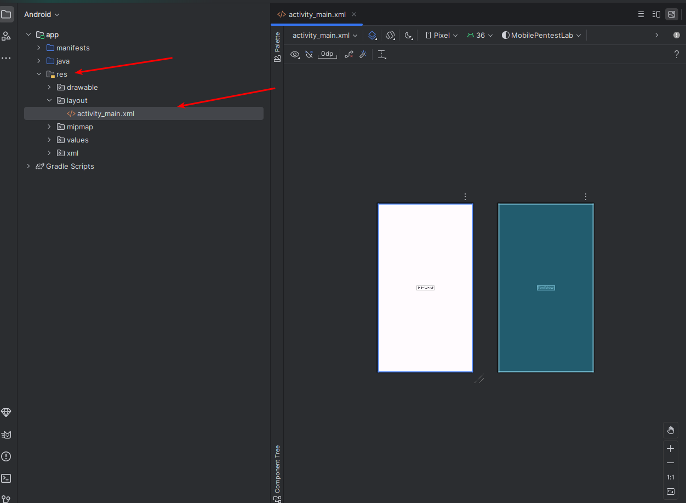

### What is Native App
- are software applications written in a specific programming language and run on a particular platform

- primarily developed using java and kotlin

### Create First app
1. display app layout in Android-studio
> app/res/layout > select activity_main.xml

Layouts define the structure of the user interface of the application
we can add text,buttons,images