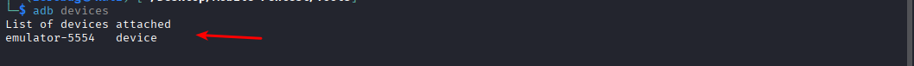
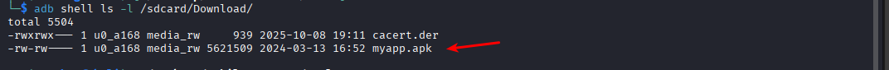
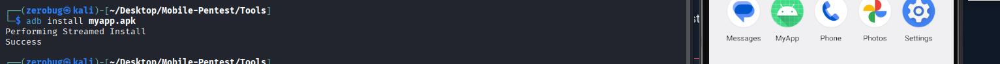
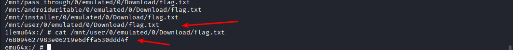
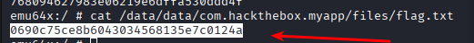
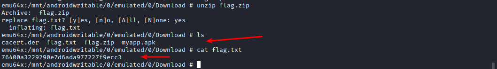
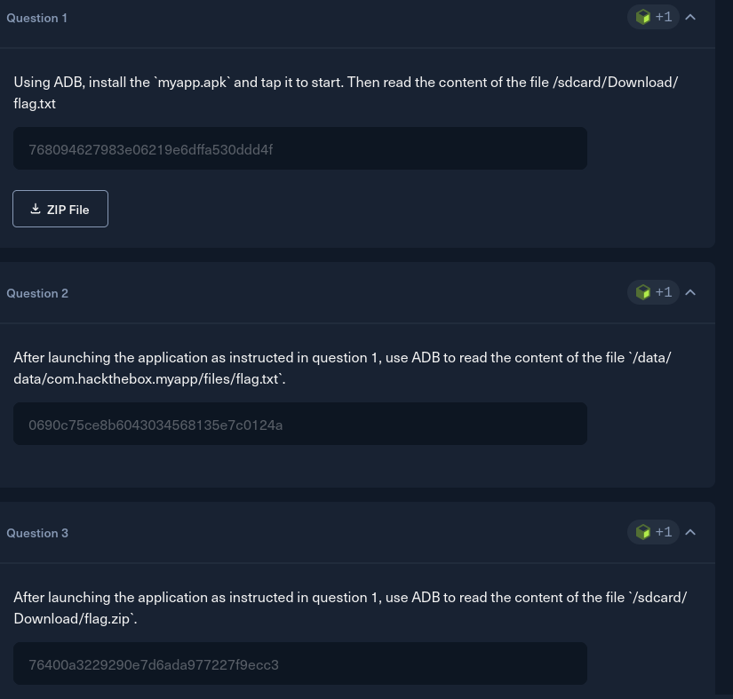

### HackTheBox- Android Fundamentals - Android Debug Bridge
1. **install apk file**
  

2. **unzip the file**
   ```bash
    unzip myapp_adb.zip
   ```
   

3. **display device that connected** 
   

4. **push apk file in device**
   ```bash
    adb push ./myapp.apk /sdcard/Download/
   ```
5. **check it's exists in device**
   ```bash
      adb shell -l /sdcard/Download/
   ```
   

6. **install apk**
   ```bash
       adb install myapp.apk
   ```
   

7. **gain shell to search for flag path by**
   ```bash
     find ~ -type f -name "flag.txt"
   ```
   

```And find flag-2```



and extract flag3


----

**Mission Done**
